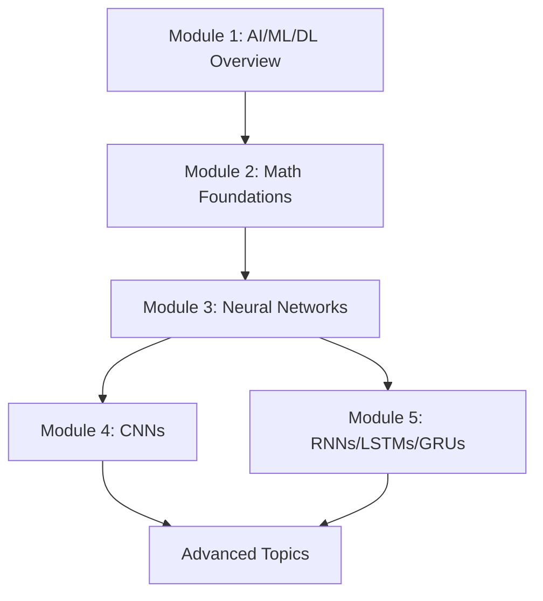

# Generative AI & Deep Learning Foundations

A comprehensive, hands-on course covering the fundamentals of Artificial Intelligence, Machine Learning, Deep Learning, and Generative AI. This repository contains complete theoretical materials, practical coding examples, and exercises designed for students to master the foundations of modern AI.

## Course Overview

This course provides a complete foundation in:
- **AI, ML, and DL fundamentals** with clear distinctions and relationships
- **Generative AI** concepts, use cases, and implementations
- **Mathematical foundations** essential for understanding AI (Probability & Linear Algebra)
- **Neural Networks** from scratch and with modern frameworks
- **Convolutional Neural Networks (CNNs)** for computer vision
- **Recurrent Neural Networks (RNNs, LSTMs, GRUs)** for sequence modeling

## Course Modules

### [Module 1: AI, ML, DL Overview & Generative AI](./module_01_ai_ml_dl_overview/)
- AI, ML, and DL fundamentals
- What is Generative AI?
- Use cases: ChatGPT, DALL-E, Stable Diffusion
- Types of Generative Models (GANs, VAEs, Diffusion Models, Transformers)

### [Module 2: Mathematical Foundations](./module_02_mathematical_foundations/)
- Probability basics for AI
- Linear Algebra for AI
- Practical exercises and visualizations

### [Module 3: Neural Networks & Backpropagation](./module_03_neural_networks/)
- Neural network fundamentals
- Backpropagation algorithm
- Implementation from scratch
- PyTorch and TensorFlow/Keras basics

### [Module 4: CNNs for Feature Extraction](./module_04_cnns/)
- CNN architecture and operations
- Convolution and pooling
- Image classification
- Transfer learning

### [Module 5: RNNs, LSTMs, GRUs for Sequence Modeling](./module_05_rnns_lstms_grus/)
- RNN fundamentals
- LSTM and GRU architectures
- Text generation
- Time series forecasting
- Sentiment analysis

## Tools & Frameworks

This course uses industry-standard tools and frameworks:

- **Python** - Primary programming language
- **Google Colab** - Cloud-based Jupyter notebooks with free GPU
- **PyTorch** - Deep learning framework
- **TensorFlow & Keras** - Deep learning frameworks
- **HuggingFace Transformers** - Pre-trained models and tools
- **NumPy** - Numerical computing
- **Pandas** - Data manipulation
- **Matplotlib & Seaborn** - Visualization

## Getting Started

### Prerequisites

- Basic Python programming knowledge
- High school mathematics (algebra, basic calculus)
- Enthusiasm to learn AI!

### Setup Options

#### Option 1: Google Colab (Recommended for Beginners)
No installation required! All notebooks can run directly in Google Colab with free GPU access.

See [Colab Setup Guide](./tools_setup/colab_setup.md)

#### Option 2: Local Setup

1. **Clone the repository:**
```bash
git clone <repository-url>
cd genai_learnings
```

2. **Create a virtual environment:**
```bash
python -m venv venv
source venv/bin/activate # On Windows: venv\Scripts\activate
```

3. **Install dependencies:**
```bash
pip install -r requirements.txt
```

4. **Download datasets:**
```bash
python datasets/download_datasets.py
```

See [Local Setup Guide](./tools_setup/local_setup.md) for detailed instructions.

#### Option 3: Conda Environment

```bash
conda env create -f environment.yml
conda activate genai-foundations
```

## How to Use This Repository

### For Students

1. **Start with Module 1** and progress sequentially
2. **Read the theory documents** in each module's `theory/` folder
3. **Work through the notebooks** in the `notebooks/` folder
4. **Complete the exercises** in the `exercises/` folder
5. **Check solutions** only after attempting exercises

### For Instructors

- Each module contains comprehensive theory and practical materials
- Notebooks are designed for live coding demonstrations
- Exercises range from guided to open-ended problems
- All code is well-commented for educational purposes

## Repository Structure

```
genai_learnings/
 README.md # This file
 requirements.txt # Python dependencies
 environment.yml # Conda environment
 setup.sh # Setup script

 module_01_ai_ml_dl_overview/ # Module 1
 theory/ # Theory documents
 notebooks/ # Jupyter notebooks
 exercises/ # Practice exercises

 module_02_mathematical_foundations/
 module_03_neural_networks/
 module_04_cnns/
 module_05_rnns_lstms_grus/

 datasets/ # Datasets and download scripts
 resources/ # Additional resources
 tools_setup/ # Setup guides
```

## Learning Path



## Key Learning Outcomes

By the end of this course, students will be able to:

 Understand the differences between AI, ML, and DL
 Explain how generative AI works and its applications
 Apply probability and linear algebra concepts to AI problems
 Build neural networks from scratch and with frameworks
 Implement CNNs for image classification tasks
 Create RNNs, LSTMs, and GRUs for sequence modeling
 Use pre-trained models from HuggingFace
 Train and evaluate deep learning models
 Debug and optimize neural networks

## Datasets Used

- **MNIST** - Handwritten digits (Neural Networks)
- **CIFAR-10** - Image classification (CNNs)
- **IMDB** - Sentiment analysis (RNNs/LSTMs)
- **Text corpora** - Text generation
- **Time series data** - Forecasting

All datasets are automatically downloaded via the provided scripts.

## Contributing

This is an educational repository. Contributions are welcome:

- Report issues or bugs
- Suggest improvements to explanations
- Add additional examples or exercises
- Fix typos or errors

## License

This repository is created for educational purposes.

## Acknowledgments

- Course materials inspired by industry best practices
- Examples adapted from official documentation of PyTorch, TensorFlow, and HuggingFace
- Community contributions and feedback

## Support

For questions or issues:
- Open an issue in this repository
- Refer to the [resources](./resources/references.md) for additional learning materials

---

**Happy Learning! **

*Master the foundations of AI and unlock the power of Generative AI*